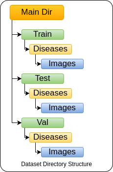

# Overview 
- data_utils_.py contains the code for splitting the dataset into appropriate folders, it also contains some functions to visualize the data
- train.py contains the main code for training as well as testing it contains the training code testing code model preprocessing as well as all the hyperparameters
- train1_se.py contains the code with SE block incorporated with the base model for better feature extraction.
- Just clone the repo and run, but make sure you change the dataset directory path, as it may be different in your local system.
- The Dataset Directory Structure is as follows:
- 
- For any help contact biplawofficial@gmail.com
